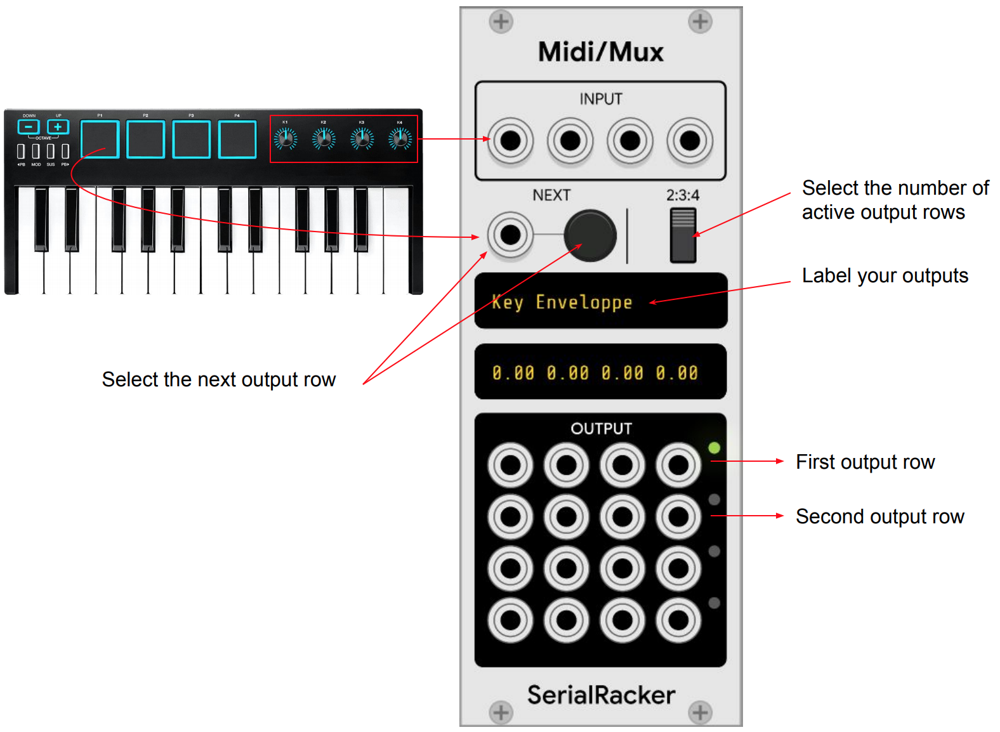

# SerialRacker

## MidiMux

MidiMux is a MIDI multiplexer - some people call it a knobulator. It
samples and hold CV values from an input row to an output row of your
choosing (four are available.) As soon as you change the output row
you can start entering new value for the new select output row but -
and that's the important part - *the previous row will keep outputing
the values it last saw.*

In short, when you connect it to a keyboard with, say, four knobs, you
can output 4 times that many CVs, as the diagram below depicts:

  

